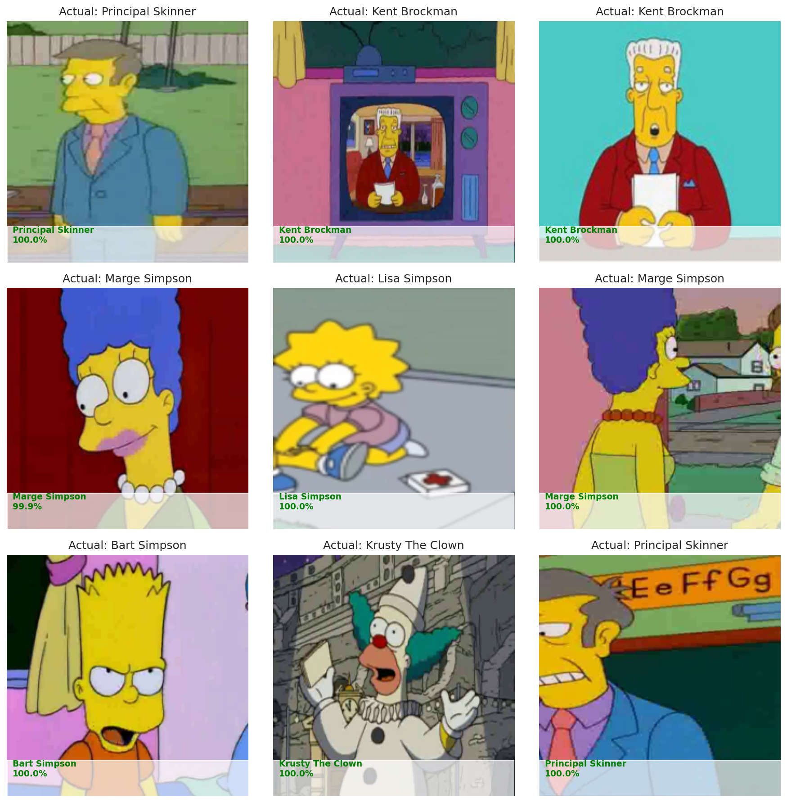

# Simpsons Character Classification

> **Best Public Score: `0.99787`**

<p align="center">
  
  <br>
  <i>Sample model predictions with confidence scores on the validation set</i>
</p>

Image classification pipeline for the [Journey to Springfield](https://www.kaggle.com/competitions/journey-to-springfield1) Kaggle competition — 42-class character recognition from *The Simpsons* using EfficientNet / ResNet / custom CNN with MLflow experiment tracking.

---

## Project Structure

```
Simpsons-Classification/
├── config.py                  # ← единственное место настроек (LR, модель, и т.д.)
├── requirements.txt
├── .gitignore
├── README.md
│
├── src/                       # core library
│   ├── __init__.py
│   ├── dataset.py             # SimpsonsDataset, DataLoader factory, upsampling
│   ├── models.py              # SimpleCnn, SimpsonResNet, SimpsonEfficientNet, build_model()
│   ├── trainer.py             # train_loop с early stopping и MLflow логированием
│   ├── metrics.py             # F1-score (без sklearn), per-class error analysis
│   ├── utils.py               # загрузка данных, label encoding
│   ├── visualization.py       # EDA, training curves, confusion matrices
│   └── logger.py              # настройка логгера (stdout + файл)
│
├── scripts/
│   ├── train.py               # точка входа: параметры берутся из config.py автоматически
│   ├── evaluate.py            # автономная оценка сохранённого чекпоинта
│   └── submit_kaggle.py       # генерация submission.csv
│
├── notebooks/
│   └── hw_5_1.ipynb
│
├── data/                      # скачивается автоматически при первом запуске
│   ├── train/
│   ├── testset/
│   └── checkpoints/
│
└── reports/                   # генерируется автоматически
    ├── logs/app.log
    ├── 01_augmentations.png
    ├── 02_sample_images.png
    ├── 03_training_history.png
    ├── 04_predictions_grid.png
    ├── 05_error_statistics.csv
    ├── 06_error_analysis.png
    ├── 07_confusion_matrix.png
    ├── 08_misclassified_examples.png
    └── training_history.csv
```

---

## Quick Start

### Prerequisites

- Python 3.12+
- CUDA-capable GPU (рекомендуется)

### Installation

```bash
git clone <repository-url>
cd Simpsons-Classification

# с uv (рекомендуется)
uv pip install -r requirements.txt

# или с pip
pip install -r requirements.txt
```

### Настройка

Откройте `config.py` и задайте нужные параметры в секции **USER SETTINGS**:

```python
MODEL_NAME   = "efficientnet-b4"   # или "resnet50", "simple_cnn" и т.д.
MAX_EPOCHS   = 25
BATCH_SIZE   = 64
LEARNING_RATE = 1e-3
FINE_TUNING  = True                # дообучить backbone после основного этапа
```

Больше ничего менять не нужно — `train.py` подхватит всё автоматически.

### Training

```bash
python scripts/train.py
# или через uv:
uv run python scripts/train.py
```

Пайплайн выполнит:
1. Скачивание и распаковку датасета (только при первом запуске)
2. EDA-отчёты в `reports/`
3. Обучение с frozen backbone → fine-tuning (если `FINE_TUNING=True`)
4. Early stopping + логирование всех метрик в MLflow
5. Сохранение лучшего чекпоинта в `data/checkpoints/best_model.pth`
6. Пост-тренировочные визуализации

### Evaluation

```bash
python scripts/evaluate.py
```

### Kaggle Submission

```bash
python scripts/submit_kaggle.py
```

Генерирует `reports/submission.csv` для загрузки на Kaggle.

### MLflow UI

```bash
uv run mlflow ui --backend-store-uri sqlite:///mlflow.db --port 5001 --host 0.0.0.0
```

Открыть: [http://localhost:5001](http://localhost:5001)

---

## Supported Models

| `MODEL_NAME`         | Тип          | Параметры (~) |
|----------------------|--------------|---------------|
| `simple_cnn`         | Custom CNN   | ~1M           |
| `resnet18`           | ResNet       | 11M           |
| `resnet50`           | ResNet       | 25M           |
| `efficientnet-b0`    | EfficientNet | 5M            |
| `efficientnet-b4`    | EfficientNet | 19M           |
| `efficientnet-b7`    | EfficientNet | 66M           |

---

## Training Configuration (defaults)

| Параметр          | Значение            |
|-------------------|---------------------|
| Optimizer         | AdamW               |
| Learning Rate     | 1e-3 (frozen), 1e-5 (fine-tune) |
| Weight Decay      | 1e-4                |
| Batch Size        | 64                  |
| Scheduler         | ReduceLROnPlateau   |
| Early Stopping    | patience=7          |
| Image Size        | 224 × 224           |
| Upsampling        | ≥ 300 samples/class |
| Val Split         | 20%                 |

---

## Tech Stack

| Library              | Version   |
|----------------------|-----------|
| Python               | 3.12+     |
| PyTorch              | ≥ 2.11.0  |
| torchvision          | ≥ 0.26.0  |
| efficientnet-pytorch | 0.7.1     |
| MLflow               | ≥ 3.11.0  |
| scikit-learn         | ≥ 1.8.0   |
| matplotlib           | ≥ 3.10.0  |
| seaborn              | ≥ 0.13.0  |
| pandas               | ≥ 2.3.0   |
| NumPy                | ≥ 2.4.0   |
| Pillow               | ≥ 12.1.0  |
| tqdm                 | ≥ 4.67.0  |
| gdown                | ≥ 5.2.0   |

---

## Reports

Все артефакты сохраняются в `reports/` автоматически:

| Файл | Описание |
|------|----------|
| `01_augmentations.png` | Примеры аугментаций тренировочных данных |
| `02_sample_images.png` | Случайная сетка изображений с метками |
| `03_training_history.png` | Кривые loss и accuracy/F1 |
| `04_predictions_grid.png` | Предсказания модели с уверенностью |
| `05_error_statistics.csv` | Частота ошибок по классам |
| `06_error_analysis.png` | Диаграммы анализа ошибок |
| `07_confusion_matrix.png` | Матрица ошибок (топ ошибочных классов) |
| `08_misclassified_examples.png` | Неверно классифицированные изображения |
| `training_history.csv` | Метрики по эпохам |
| `logs/app.log` | Лог приложения |

---

## License

Проект предназначен для учебных и соревновательных целей.
